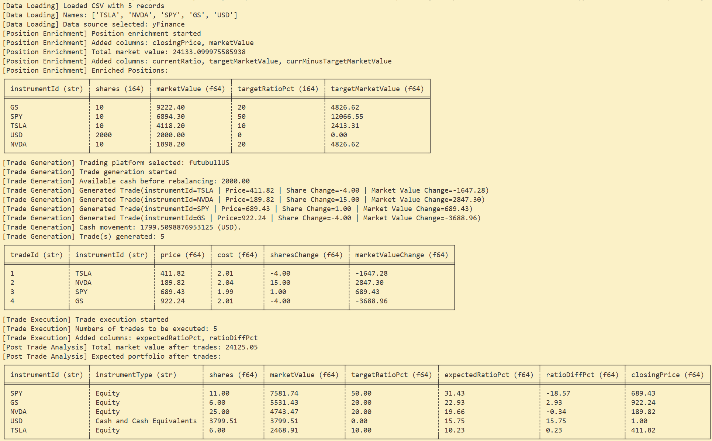

# Portfolio Rebalancer

## Project Overview

### Use Case

This script automates the process of rebalancing a portfolio to ensure the portfolio's allocations match the target ratios.

### What it does 
1. Loads portfolio data from a CSV file.
2. Enriches the portfolio data by fetching historical pricing data for each instrument (via Yahoo Finance).
3. Rebalances the portfolio by generating trades to adjust positions based on target allocation percentages.
4. Calculates transaction costs for trades, and applies them to the portfolio.
5. Outputs an analysis of the portfolio post-trades, including updated market values and the difference between expected and target allocations.

## Installation
### Prerequisites
|item|version|
|-|-|
|Python|>=3.13.0|
|uv|>=0.6.5|

To install the required dependencies, use `pip`:

```bash
uv pip install -r requirements.txt
```

## How to Run

### Set Up the Data File

Prepare your portfolio data in CSV format and place it under `data/`.
An example file `data/portoflio_example.csv` has been placed under the folder for easy reference.

### Running the Script

Run the script by executing the following command:

```bash
python rebalance_portfolio.py --portfolioCSV ./data/<target portfolio csv>
```

## Example Screenshot

