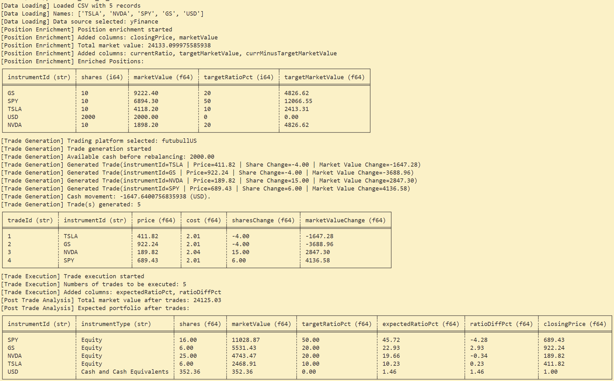

# Portfolio Rebalancer

## Project Overview

### Use Case

This script automates the process of rebalancing a portfolio to ensure the portfolio's allocations match the target ratios, optionally adding leverage through LEAPS call stock replacement.

### What it does
1. Loads portfolio data from a CSV file (equity rows, cash rows, and optional LEAPS Call option rows).
2. Enriches the portfolio data by fetching pricing data for each instrument (equity via Yahoo Finance; option premium/delta via Alpaca snapshots when option rows are present — delta comes from Alpaca only, and runs abort when it is unavailable).
3. Plans trades per underlying "sleeve": drift rebalancing for plain equity sleeves, and the LEAPS lifecycle (initiate / keep / resize / roll / liquidate) for the designated sleeve.
4. Executes trades through a funding waterfall (contract sells → equity sells → contract buys → equity buys → cash residual) and calculates per-row transaction costs (Futu HK US fee schedule).
5. Outputs the post-trade portfolio (market values and ratios) plus a per-underlying exposure report with achieved leverage, tracking error, and total fees.

## Installation
### Prerequisites
|item|version|
|-|-|
|Python|>=3.13.0|
|uv|>=0.6.5|

To install the required dependencies, use `pip`:

```bash
uv pip install -r requirements.txt
```

### Environment variables

When the CSV contains LEAPS option rows, live option quotes come from Alpaca Market Data. Copy `.env.example` to `.env` and fill in your keys:

```
APCA_API_KEY_ID=...
APCA_API_SECRET_KEY=...
```

Runs without option rows need no Alpaca credentials.

## How to Run

### Set Up the Data File

Prepare your portfolio data in CSV format and place it under `data/`.
Examples: `data/portfolio_example.csv` (plain equity + cash) and `data/portfolio_example_leaps.csv` (with a LEAPS sleeve).

CSV columns: `instrumentId`, `idType`, `instrumentType`, `shares`, `targetRatioPct`, `timestamp`, and the optional `leapsSleeve` marker.

- Equity rows: `idType=ticker`, `instrumentType=Equity`, `targetRatioPct` = target weight (equity weights must sum to 100).
- Cash rows: `idType=name`, `instrumentId=USD`, `instrumentType=Cash and Cash Equivalents`.
- Option rows: `idType=occ`, `instrumentId` = OCC symbol (e.g. `VOO280619C00420000`), `instrumentType=LEAPS Call`, `shares` = contract count, no target weight (leave `targetRatioPct` empty). Mark exactly one underlying's rows with `leapsSleeve=true` to designate the LEAPS sleeve.

### Running the Script

Run the script by executing the following command:

```bash
uv run python main.py --portfolioCSV data/portfolio_example.csv
```

Options:

- `--leverage L` — portfolio-level leverage target (default 1.0; total equity exposure aims for L × portfolio market value).
- `--liquidate-leaps` — deliberately proceed when held LEAPS would otherwise be liquidated (no sleeve marker, or L at the 1.0 default).

LEAPS example:

```bash
uv run python main.py --portfolioCSV data/portfolio_example_leaps.csv --leverage 1.5
```

## How LEAPS leverage works

- The target total equity exposure is L × portfolio market value. The designated sleeve's underlying carries (weight + L − 1) × MV of that exposure; every other sleeve stays at its base weight.
- Delivery is contracts-first: deep-in-the-money LEAPS calls (≈0.85 delta, ≥21 months to expiry) sized round-to-nearest per contract (~delta × 100 × spot exposure each), with a share residual absorbing the rounding difference.
- When the held contract drops inside 12 months to expiry, it is rolled: sell the held contract, buy a replacement selected by rule (latest qualifying expiry, strike nearest 0.85 delta, spread filters) — no prompts.
- Fees are computed per trade row under the Futu HK US options/equity schedule and are paid from the cash residual; the exposure report shows achieved leverage, per-sleeve tracking error, and total fees each run.

## Example Screenshot

