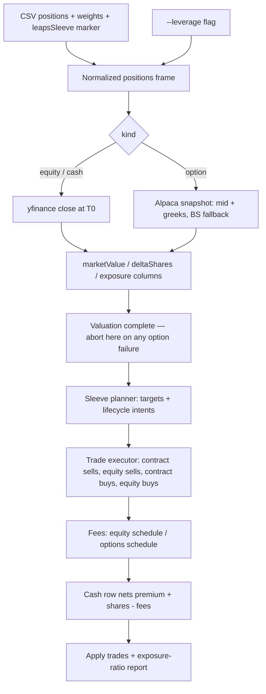
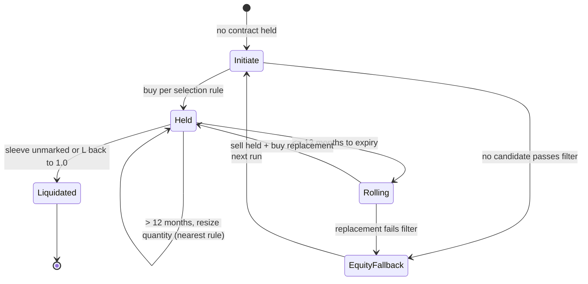

# feat: LEAPS lifecycle leverage via stock replacement

## Summary

Extend the rebalancer so a portfolio-level leverage target L is delivered through one designated LEAPS sleeve: option positions valued from Alpaca at delta-adjusted exposure, contracts sized to carry the portfolio's entire leverage excess, a 12-month roll rule, rule-based automatic contract selection, Futu HK option fees, and a combined stock + LEAPS trade list with an exposure report. Fully non-interactive — the trade list is the decision surface; the user executes at Futu.

## Problem Frame

The tool rebalances equities and cash toward target weights but cannot express an option position — no contract pricing, delta semantics, per-contract fees, or expiry. Lifecycle investing (Ayres/Nalebuff) needs leveraged exposure via defined-premium LEAPS, managed monthly without hand-computing premiums, exposure, contract counts, and rolls. Full problem frame and product decisions: see origin `docs/brainstorms/2026-09-01-leaps-lifecycle-leverage-requirements.md`.

## Requirements

Carried from origin R-IDs; revisions made during the 2026-09-01 planning session are resolved in place.

### Inputs and valuation

- R1. CSV carries equity positions, cash, per-underlying weights summing to 100, held LEAPS rows (OCC symbol + contract quantity, no target weight), and a `leapsSleeve` marker designating the sleeve. Leverage L arrives as `--leverage` (default 1.0).
- R2. LEAPS are valued from Alpaca snapshots at run time: premium = mid of latest quote; delta = snapshot greeks, Black-Scholes fallback when null.
- R3. Equities and cash keep the current yfinance-at-timestamp valuation path; the same T0 equity spots price option exposure (single basis across the frame — run-time numbers are premium and delta only).
- R4. Exposure is delta-adjusted: one contract contributes 100 × delta shares-equivalent.

### Target construction

- R5. Total target exposure = L × portfolio market value.
- R6. Non-designated underlyings target weight × MV in shares.
- R7. The designated sleeve targets (weight + L − 1) × MV of exposure. Contract count rounds to nearest; the signed share residual (buy or sell) absorbs the difference, clamped so the sleeve never sells more shares than it holds; whatever survives integer share rounding is tracking error.
- R8. Contract counts round to nearest with overshoot/undershoot flagged; share quantities stay best-effort integer as today. The same nearest rule governs resizing a held position up or down.

### Contract lifecycle

- R9. Held contract with > 12 months to expiry: keep, trade only the quantity delta (nearest rule).
- R10. Held contract at ≤ 12 months: roll — sell held, buy rule-selected replacement.
- R11. No contract held on the designated underlying: initiate.
- R12. *(amended — Alpaca snapshots expose no open interest)* Selection prefers the latest standard expiry at least MIN_EXPIRY_MONTHS (21) out, the strike nearest 0.85 delta, filtered for liquidity by relative spread, bid > 0, volume, and same-day quote freshness.
- R13. *(superseded 2026-09-01, user decision)* Contract selection is automatic and non-interactive. Selection reasoning appears in the run output; there is no confirmation gate. If no candidate passes the liquidity filter, the sleeve falls back to base-weight shares with the leverage shortfall reported as tracking error — including mid-roll, where the held contract is sold first and the sleeve then de-levers to base weight.
- R17. *(user decision)* A held contract on a non-designated underlying gets an automatic liquidation sell trade in the list; its underlying may have no equity row (option-only sleeve with target 0). Liquidation is never triggered by omission: if option rows exist with no sleeve marker, or with `--leverage` left at the 1.0 default, the run aborts unless `--liquidate-leaps` is passed explicitly — a typo must not de-lever the portfolio.
- R21. A roll whose only failure is the MIN_EXPIRY_MONTHS floor (qualifying candidates exist at shorter expiries) defers to the next run with a "roll deferred — chain depth" reason; the sell-and-de-lever fallback fires only on liquidity-filter failure. For option-only sleeves, the underlying spot is fetched via the equity price source so exposure and the report stay defined.

### Trades and reporting

- R14. Every trade row carries a human-readable reason (drift rebalance, resize, roll triggered, initiation, replacement, liquidation, cash residual, shares fallback).
- R15. Option trades use the verified Futu HK options schedule; equities keep the existing equity schedule.
- R16. Post-trade report shows target vs achieved exposure per underlying (exposure ratios, not market-value ratios, are the control variable), achieved total leverage, and tracking error.
- R19. Report figures use run-time marks — T0 equity spots plus run-time premiums and deltas — and achieved leverage divides total post-trade exposure by pre-trade portfolio MV.
- R20. The cash trade row nets contract premium flows, share flows, and all transaction costs; the report itemizes total fees.

### Security and config

- R18. Alpaca credentials live in a gitignored `.env` (APCA_API_KEY_ID / APCA_API_SECRET_KEY) loaded via `python-dotenv`; never in source or tracked files. *(Origin's "read-only scoped keys" is not implementable — Alpaca issues one account-wide key pair; storage discipline is the control.)*

## Key Technical Decisions

- **Normalized single positions frame (monetised-delta model).** One polars frame holds equity, cash, and option rows with kind-specific nulls. Uniform columns — `quantity`, `price`, `multiplier` (1/1/100), `deltaAdj` (1/0/delta) — derive `marketValue = quantity × price × multiplier` (cash impact) and `exposure = quantity × multiplier × deltaAdj × underlyingSpot` (leverage impact). Equity rows degenerate to exposure = marketValue, which is the back-compat invariant: at L = 1 with no sleeve the frame reproduces today's outputs cell-for-cell (regression-tested in U5). User-confirmed over a two-frame split.
- **Polars-first pipeline.** DataFrames remain the pipeline currency, matching the existing code; pydantic only for `Trade` (existing) and the new `OptionSnapshot`. User-confirmed over a domain-object rewrite.
- **Sleeve planner / executor split.** A planner stage groups the frame by underlying, computes sleeve exposure targets, and emits per-sleeve order intents (contract counts + share quantities, computed jointly against sleeve exposure). The existing `generateTrades` row loop is demoted to an executor that consumes intents. Option sizing is never bolted onto the row loop — its cash-constrained share math and per-row `currMinusTargetMarketValue` assumptions do not survive contact with contracts.
- **Funding waterfall.** Trade order within a run: contract sells → equity sells → contract buys → equity buys → cash row last. Contract buys are never cash-truncated (premium is a small fraction of MV and truncating a contract changes leverage materially); equity buys remain cash-constrained as today, funded by everything above them. The cash row nets premium flows, share flows, and all fees (R20).
- **Sleeve aggregation layer.** The sleeve table (current vs target exposure per underlying) drives the lifecycle decision and contract sizing; trade generation stays per-instrument. This is the "target monetised delta = L × MV, diff, generate trades" computation model.
- **Alpaca via raw REST, not alpaca-py.** Two GET endpoints (`/v1beta1/options/snapshots?symbols=` for held contracts, ≤ 100 symbols; `/v1beta1/options/snapshots/{underlying}` with `expiration_date_gte`/`strike_price_gte`/`type` filters + `next_page_token` pagination for selection) don't justify the SDK's weight. Headers `APCA-API-KEY-ID` / `APCA-API-SECRET-KEY`, `feed=indicative` explicit (defaults to `opra` when subscribed, which free keys are not), base `https://data.alpaca.markets`. Rate limit 200 req/min is ample for a monthly run.
- **Separate option-source ABC.** The existing `PriceDataSource.getClosingPrice(ticker, date)` is historical-date shaped and cannot carry live quotes with freshness checks. A sibling `OptionQuoteSource` ABC + factory in `options_data.py` mirrors the existing provider idiom without overloading the equity interface.
- **Black-Scholes fallback is closed-form + IV solve.** Delta from the BS formula; when greeks are null, IV is backed out of the mid-quote by bisection (spot, strike, expiry, rate known), then delta computed. `RISK_FREE_RATE` and `DIVIDEND_YIELD` are module constants (defaults 0.04 / 0.0) — delta of deep-ITM LEAPS is insensitive to small errors here, and the fallback fires rarely.
- **Fee model: one trade row = one order.** Each generated row is charged independently, so the $1.99 commission minimum applies per row — matching Futu's per-leg treatment and how the user executes each leg as a separate order. The `TradingPlatform` ABC gains an options-cost method implemented on `FutuBullUS` (one platform object, two schedules); for option rows `quantityChange` means contracts.
- **`--leverage` defaults to 1.0.** CSVs without a sleeve marker and without the flag behave exactly as today — back-compat for existing dated snapshots.
- **Liquidity filter constants.** `MAX_REL_SPREAD = 0.10` (spread/mid), `MIN_DAILY_VOLUME = 1`, bid > 0, and same-day quote timestamp. Open interest is not available from Alpaca snapshots; volume + freshness substitute.
- **Module layout.** `main.py` stays the entry and keeps the pipeline; self-contained new domains extract to `options_data.py` (REST client, `OptionQuoteSource` ABC + factory, OCC parse, snapshot model) and `black_scholes.py` (pure math). First test suite under `tests/` with pytest as a uv dev dependency.
- **Alpaca failure = abort before trade generation.** All valuation completes before any trade is generated; an option-valuation failure aborts the run — a partially valued frame must never produce equity-only trades. There is no stale fallback (historical option data is paywalled to the last 15 minutes on the free tier). Re-running shifts ~15-minute-delayed equity marks; accepted.

## High-Level Technical Design

## Implementation Units

### U1. OCC symbol parsing and option models

- **Goal:** Parse OCC option symbols into contract specs; define the `OptionSnapshot` model; establish the test toolchain.
- **Requirements:** R1, R4.
- **Dependencies:** none.
- **Files:** `options_data.py` (new), `tests/test_occ.py` (new), `pyproject.toml` + `uv.lock` (add pytest dev dependency via uv's dev group).
- **Approach:** Parse fixed offsets from the right (last 15 chars = YYMMDD + C/P + strike×1000 padded to 8); root is everything left of that, stripped of padding. `OptionSnapshot` (pydantic): symbol, underlying, expiry, strike, right, bid, ask, mid, delta, iv, quoteTimestamp, volume. New modules sit at repo root, matching the flat layout.
- **Patterns to follow:** pydantic `Trade` model in `main.py`.
- **Test scenarios:**
  - Happy path: `VOO270115C00450000` → VOO / 2027-01-15 / call / 450.000.
  - Put variant and a low strike (`TSLA260619P00005000` → 50.000 put).
  - Edge: root shorter than 6 chars unpadded (`AAPL260619C00250000`); root at full 6-char width.
  - Error: symbol too short, non-digit strike, invalid date round-trip.
- **Verification:** Parser round-trips every generated spec; malformed symbols raise a descriptive error naming the symbol; `pytest` runs via uv.

### U2. Black-Scholes module

- **Goal:** Closed-form BS delta and an IV solver for the greeks-null fallback.
- **Requirements:** R2.
- **Dependencies:** none.
- **Files:** `black_scholes.py` (new), `tests/test_black_scholes.py` (new).
- **Approach:** Standard BS call delta N(d1); bisection IV solve against a known mid. Constants `RISK_FREE_RATE = 0.04`, `DIVIDEND_YIELD = 0.0`. Pure functions, no I/O.
- **Execution note:** Implement test-first — known-value tests from a reference BS table before the formulas land.
- **Test scenarios:**
  - Happy path: delta of a deep-ITM call (spot 700, strike 450, 2y, IV 0.25) ≈ 0.9+.
  - Edge: near-expiry deep ITM → delta → 1.0; far OTM → → 0.0.
  - Round-trip: IV solved from a mid priced by the same model recovers the input IV within tolerance.
  - Error: zero/negative time to expiry, negative volatility inputs raise.
- **Verification:** Deltas match reference values within 1e-4; IV round-trip converges within 50 bisection iterations.

### U3. Alpaca option data source

- **Goal:** Fetch snapshots for held contracts and filtered chains for selection, with auth, fallback, and failure handling.
- **Requirements:** R2, R12, R18.
- **Dependencies:** U1, U2.
- **Files:** `options_data.py`, `tests/test_alpaca_client.py` (new), `.env.example` (new), `.gitignore` (modify), `pyproject.toml` (promote `requests` to a direct dependency — already present transitively via yfinance; `python-dotenv` already declared).
- **Approach:** `requests` GETs with the two auth headers, `feed=indicative` explicit; snapshots for held symbols; chain calls with server-side expiry/strike/type filters and `next_page_token` pagination. Mid = (bid+ask)/2 with bid > 0 and same-day quote-timestamp checks; stale or missing quote → BS fallback only when IV is derivable, otherwise raise. Keys via `python-dotenv` from `.env`. HTTP errors are re-raised with status and message only — never the request object or headers, mirroring the env-key sanitization. Define the `OptionQuoteSource` ABC + factory here (sibling to `PriceDataSource`, not an overload of `getClosingPrice`).
- **Test scenarios:**
  - Happy path: snapshot JSON → `OptionSnapshot` with correct mid/delta (fixtures, no network).
  - Happy path: chain pagination — two pages joined, `next_page_token` honored.
  - Edge: null greeks → BS fallback delta computed from IV solved off mid.
  - Edge: bid = 0 or stale quote timestamp → rejected by the freshness check.
  - Error: HTTP 401/429/500 → descriptive exception; missing env keys → error naming the variable, never a stack trace.
- **Verification:** All client tests pass against fixture responses with zero network calls; `.env` is gitignored and `.env.example` documents both variables.

### U4. Options fee schedule

- **Goal:** Compute Futu HK option trade costs per the verified table.
- **Requirements:** R15.
- **Dependencies:** none.
- **Files:** `main.py` (extend `TradingPlatform` and `FutuBullUS`), `tests/test_fees_options.py` (new).
- **Approach:** Add an options-cost method to the `TradingPlatform` ABC, implemented on `FutuBullUS`: commission max(0.65 × contracts, 1.99); platform 0.30 × contracts; ORF 0.013 × contracts; OCC min(0.02 × contracts, 55); settlement 0.18 × contracts; CAT 0.0003 × contracts; sells add SEC 0.0000206 × value (min 0.01) and FINRA 0.00329 × contracts (min 0.01). `quantityChange` carries contract counts for option rows. `Trade.calcTransactionCost` dispatches by kind.
- **Patterns to follow:** existing `calcTransactionCost` equity schedule with its min/max clamp style in `main.py`.
- **Test scenarios:**
  - Happy path: 2-contract buy at premium 24.22 → commission max(1.30, 1.99) = 1.99 + 0.60 + 0.026 + 0.04 + 0.36 + 0.0006.
  - Happy path: 5-contract sell adds SEC fee on notional and FINRA per-contract minimums.
  - Edge: OCC cap at $55 on a 3000-contract trade.
  - Edge: single-contract trade hits the 1.99 commission floor.
- **Verification:** Fee outputs match hand-computed values from the Futu HK table for buy and sell legs.

### U5. Normalized frame and input surface

- **Goal:** Load the extended CSV + CLI flag into the normalized positions frame.
- **Requirements:** R1, R18.
- **Dependencies:** U1.
- **Files:** `main.py`, `tests/test_positions_frame.py` (new), `data/portfolio_example_leaps.csv` (new example).
- **Approach:** `--leverage` argparse flag default 1.0. CSV gains `leapsSleeve` marker column; option rows use `idType=occ`, `instrumentType=LEAPS Call`, empty target weight. Validation: at most one designated underlying; L ≥ 1.0; option rows may reference an underlying with no equity row (option-only sleeve — routed to liquidation, never an error); weights-sum-to-100 validation counts equity rows only and moves to frame-load time (see U9 for the enrichment-side rework).
- **Patterns to follow:** existing CSV load + `positionSchema` declaration in `main.py` (wire the schema up or delete the dead constant — pick one during implementation).
- **Test scenarios:**
  - Happy path: mixed CSV (equities + cash + 1 option row + marker) → normalized frame with correct kind/quantity/multiplier columns.
  - Edge: no marker, no flag → frame identical to today's load path (back-compat anchor for U9's regression test).
  - Edge: option row whose underlying has no equity row → loads fine, flagged option-only sleeve.
  - Error: two sleeve markers; L = 0.8 → rejected; malformed OCC symbol in a row → descriptive error.
- **Verification:** Example CSV loads into the normalized frame; legacy CSV loads unchanged.

### U9. Kind-dispatched enrichment and validation rework

- **Goal:** Value every row by kind and produce the exposure columns; re-home the validations that option rows break.
- **Requirements:** R2, R3, R4, R5.
- **Dependencies:** U3, U5.
- **Files:** `main.py` (rewrite of `enrichPositions` internals), `tests/test_enrichment.py` (new).
- **Approach:** Dispatch by kind: yfinance close for equity (unchanged path), snapshot for options, 1.0 price for cash; then uniform marketValue/deltaShares/exposure columns; option exposure uses the frame's T0 underlying spot (single basis, R3). Validation rework: weights-sum check counts equity rows only (option rows carry null weights — the current all-rows sum in `enrichPositions` would raise on every LEAPS CSV); fix the `timestamp` str-vs-Date handling the current `strptime` path papers over; resolve the dead `positionSchema` constant. All valuation completes before any trade generation — option-valuation failure aborts the run here.
- **Patterns to follow:** existing `enrichPositions` column flow in `main.py`.
- **Test scenarios:**
  - Happy path: mixed CSV with fixture prices → correct marketValue and exposure for every kind; VOO equity + option rows aggregate to sleeve exposure.
  - Covers AE2 (frame level): the 2-contract case yields 119k sleeve exposure.
  - Edge: null-greeks option → BS-fallback delta appears in the exposure column.
  - Edge: back-compat regression — legacy CSV, no flag → enriched output matches pre-change behavior cell-for-cell (exposure ≡ marketValue at L = 1).
  - Error: option valuation raises → run aborts before trade generation with a clear message.
  - Error: held option rows with no sleeve marker or default L → abort demanding `--liquidate-leaps` or corrected inputs.
- **Verification:** Enriched tables show exposure columns; the legacy regression test passes bit-for-bit.

### U6. Sleeve planner and sizing math

- **Goal:** Compute sleeve targets, emit order intents, and extend the `Trade` model the intents produce.
- **Requirements:** R5, R6, R7, R8, R14.
- **Dependencies:** U5, U9.
- **Files:** `main.py`, `tests/test_sizing.py` (new).
- **Approach:** Group by underlying → sleeve table (current exposure, target exposure per R5–R7). Contract sizing: round-to-nearest for initiation and resize alike; signed share residual absorbs the difference, clamped at zero-held; survivors of integer share rounding are tracking error. Extend `Trade` here (not U8) with `underlying`, `quantityKind`, `exposureChange`, `reason` — U6's intents are the first producer. The planner emits intents per sleeve; the existing `generateTrades` loop becomes the executor (U8 wires it).
- **Execution note:** Implement test-first — the AE2 arithmetic is the acceptance anchor.
- **Test scenarios:**
  - Covers AE2: MV 100k, weight 55, L 1.5, 0.85δ at $700 → 2 contracts (119k), share residual absorbs −14k (sell), achieved leverage ~1.64x, error flagged.
  - Happy path: L = 1.0 with designated sleeve → sleeve target = base weight, contract count → 0, shares only.
  - Edge: resize on L cut (held 2 contracts ≈ 119k, L 1.5 → 1.1 shrinks target to ~65k) → sells to nearest count, direction flagged.
  - Edge: nearest-rounding boundary (1.5 contracts) flags residual direction.
  - Edge: sleeve target smaller than one contract → 0 or 1 by nearest rule, flagged.
  - Edge: negative share residual exceeding held shares → clamped, remainder becomes tracking error.
  - Error: negative sleeve target (weight + L − 1 < 0) → validation error before sizing.
- **Verification:** Sizing outputs match hand-computed contract counts and residuals across the scenario set, including the L-cut resize.

### U7. Contract lifecycle and selection

- **Goal:** Decide keep/resize, roll, initiate, or liquidate; select contracts by rule; fall back to shares when no candidate qualifies.
- **Requirements:** R9–R13, R17.
- **Dependencies:** U3, U6, U9.
- **Files:** `main.py`, `tests/test_lifecycle.py` (new).
- **Approach:** Time-to-expiry branch per the state diagram. Selection: chain filtered to expiries ≥ 21 months, calls only, liquidity filter constants, strike nearest 0.85 delta. Non-designated or option-only sleeves → liquidation sells. No-candidate → base-weight shares fallback with reason + tracking error — including mid-roll, where the held contract sells first. Resize trades carry the resize reason (R14).
- **Test scenarios:**
  - Covers AE1: 9-months-to-expiry contract → sell + replacement selected per rule, roll reason on both rows, no prompts.
  - Covers AE3: 20-months contract → no selection call, quantity delta only.
  - Happy path: initiation with no held contract → chain call, nearest-0.85-delta strike chosen among qualifying expiries.
  - Edge: every chain candidate fails the spread filter → shares fallback, shortfall reported.
  - Edge: roll whose replacement fails the filter → held contract sold, sleeve de-levers to base weight, reasons on every row.
  - Edge: roll where candidates exist only below MIN_EXPIRY_MONTHS → roll deferred with "roll deferred — chain depth" reason, held contract kept.
  - Edge: contract on an option-only sleeve (no equity row) → liquidation sell generated.
  - Edge: hold 2, target 1 → sell 1 contract, premium routed to the cash netting.
  - Error: chain request returns zero snapshots → treated as no-candidate fallback, logged.
- **Verification:** Given fixture chains, each lifecycle branch produces exactly the expected trade intents with reasons.

### U8. Trade execution, reporting, and wiring

- **Goal:** Execute planner intents with the funding waterfall, apply trades, produce the exposure report; wire the CLI end to end.
- **Requirements:** R5, R8, R14, R15, R16, R19, R20.
- **Dependencies:** U4, U6, U7.
- **Files:** `main.py`, `tests/test_integration_pipeline.py` (new), `README.md` (modify).
- **Approach:** Executor consumes intents in waterfall order: contract sells → equity sells → contract buys → equity buys → cash row netting premium flows, share flows, and fees. Contract buys never cash-truncated; equity buys cash-constrained as today. Fix `applyTrades` while touching it: the full join's `closingPrice` coalesce drops trade-side prices for new instruments (pre-existing bug), and the select must preserve sleeve/kind columns plus a schema for trade-introduced option rows. Post-trade report: per-underlying shares + contracts + current/target exposure + diff, exposure ratios as the control variable, achieved leverage per R19, tracking error, fee total. Update README run instructions (also fixing the stale `rebalance_portfolio.py` reference) and ship the example CSV.
- **Patterns to follow:** existing `generateTrades` ordering, `applyTrades` join, `printEnrichedPostTradePositions` table style in `main.py`.
- **Test scenarios:**
  - Happy path end-to-end: mixed fixture CSV + mocked sources → trade list with reasons, correct per-row fee minimums, and a report whose achieved leverage equals the hand-computed R19 fraction.
  - Covers AE1, AE2, AE3 at pipeline level.
  - Integration: a roll run produces paired sell/buy rows, each with per-row fee minimums, and the cash row nets premium + share flows − fees.
  - Edge: trade in a not-previously-held instrument → post-trade price and exposure columns populated (regression for the join bug).
  - Edge: zero trades needed → report only, no fee artifacts.
  - Back-compat: legacy CSV + no flag → output matches the pre-change format.
- **Verification:** `python main.py --portfolioCSV data/portfolio_example_leaps.csv --leverage 1.5` produces the full trade list and exposure report against live sources; legacy invocation unchanged.

## Risks and Dependencies

- Indicative-feed quotes and greeks are approximate (delayed, derived); monthly cadence makes this acceptable, and the freshness check rejects stale data rather than trading on it.
- Delta drifts between runs — reported leverage is true only at the run snapshot; no mid-month trigger exists by design.
- Contract granularity (~$50–60k exposure per contract) dominates at current portfolio size; the report surfaces tracking error every run so granularity creep stays visible.
- Alpaca is a hard runtime dependency; failure aborts the run before trade generation (no degraded-mode trading).
- Fee schedule is time-stamped 2026-09 and Futu revises periodically; constants live in one module for easy re-verification.
- `applyTrades` carries a latent closing-price coalesce bug today; U8 fixes it as part of the integration it already owns — verified by a new-instrument regression test.

## Scope Boundaries

### Deferred for later

- Multiple LEAPS sleeves, contract ladders, put-based leverage, glide-path automation (origin scope boundary).
- Roll-cost reporting (round-trip spread drag surfaced per roll) — worth adding once real rolls exist.

### Outside this product's identity

- Margin/futures leverage, backtesting with historical option prices, trade execution (origin scope boundary).

### Deferred to Follow-Up Work

- Restructuring `main.py` beyond the two extracted modules — only if the file becomes genuinely unwieldy during implementation.

## Open Questions

None blocking. Tunable constants (`MIN_EXPIRY_MONTHS`, `MAX_REL_SPREAD`, `MIN_DAILY_VOLUME`, `RISK_FREE_RATE`, `DIVIDEND_YIELD`, target delta 0.85) are named module-level defaults, adjustable without redesign; revisit after the first live roll.

## Sources and Research

- Origin requirements: `docs/brainstorms/2026-09-01-leaps-lifecycle-leverage-requirements.md` (includes the verified Futu HK fee table and the live VOO snapshot sample).
- Alpaca docs: optionsnapshots and optionchain references, market-data plans/feeds (rate limits, indicative vs opra), historical option data (15-minute free-tier boundary) — fetched 2026-09-01 from `docs.alpaca.markets`.
- Existing implementation to extend: `main.py` — `PriceDataSource` abstraction, `TradingPlatform` fee abstraction, `enrichPositions` (validation lives inside it), `generateTrades` sells-first loop, `applyTrades` full join, post-trade report.
- Deepening pass (2026-09-01): spec-flow, architecture, and repo-pattern analyses of this plan — source of the planner/executor split, funding waterfall, validation rework, state-machine transitions, and the `applyTrades` bug finding.
